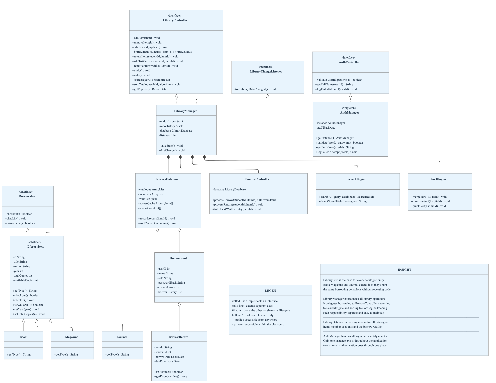

# SLCAS — Smart Library Circulation & Automation System
## Project Report | COS 202 | MIVA Open University

---

## Group Members

| # | Name | Matric No. | Email |
|---|------|-----------|-------|
| 1 | Olalere Isaiah Toluwani | 2024/B/SENG/0830 | olalere.isaiah@miva.edu.ng |
| 2 | Idowu Oluwadamilare | 2024/B/SENG/0291 | idowu.oluwadamilare@miva.edu.ng |
| 3 | Daniel Oluwasemilore Abiodun | 2024/B/SENG/0250 | daniel.abiodun1@miva.edu.ng |
| 4 | Mustapha Abdulafeez | 2024/B/CSC/0212 | abdulafeez.mustapha@miva.edu.ng |
| 5 | Mujeeb Raheem | 2024/B/CSC/0181 | mujeeb.raheem@miva.edu.ng |
| 6 | Livingstone Joseph Obochi | 2024/B/CYB/0320 | livingstone.obochi@miva.edu.ng |
| 7 | Akinniyi Adeleke Solomon | 2024/B/CYB/0273 | adeleke.akinniyi@miva.edu.ng |
| 8 | Ganiyat Jolayemi Omowunmi | 2024/B/CYB/0337 | ganiyat.jolayemi@miva.edu.ng |
| 9 | Dolapo Opebi Anuoluwapo | 2024/B/CYB/03H | dolapo.opebi@miva.edu.ng |
| 10 | Simon Ochayi Ujor | 2024/B/CYB/0787 | simon.ujor@miva.edu.ng |
| 11 | Divine Okpara | 2024/B/CYB/0397 | divine.okpara@miva.edu.ng |
| 12 | Cherechi Udensi | 2024/B/CYB/0430 | cherechi.udensi@miva.edu.ng |
| 13 | Folorunsho Oluwatobi | 2024/B/IT/0082 | folorunsho.oluwatobi@miva.edu.ng |

---

## 1. Description

SLCAS is a Java SE desktop application that automates university library operations: catalogue management, student loan tracking with 14-day due dates, reservation queuing, staff administration, and report generation. The interface is styled with FlatLaf 3.6 for a modern, consistent appearance across platforms.

Three user roles shape how the system is accessed. **Admins** have full control: they manage the catalogue, register students, administer staff accounts, and access the audit log and reports. Sensitive actions require password re-confirmation. **Librarians** handle daily desk work: processing borrows and returns, managing the waitlist, and searching the catalogue. They cannot modify catalogue structure, manage staff, or view logs. **Students** do not log in; they are account holders whose loans, overdue history, and waitlist reservations are tracked by staff.

The codebase follows a strict **MVC** structure across five packages. The `model` package owns all data (`LibraryItem` abstract base, `Book`/`Magazine`/`Journal` subtypes, `UserAccount`, `BorrowRecord`, `LibraryDatabase`). The `controller` package holds all business logic (`LibraryManager` as central coordinator, `BorrowController`, `SearchEngine`, `SortEngine`). The `gui` package holds ten screens with zero logic, each communicating only through the `LibraryController` interface. Utilities live in `utils`; the entry point is in `main`.

All four OOP pillars are applied meaningfully. **Abstraction**: `LibraryItem` forces every subtype to implement `getType()` whilst sharing validation and borrow logic. **Inheritance**: `Book`, `Magazine`, and `Journal` extend `LibraryItem` without duplication. **Polymorphism**: all screens operate through `LibraryController`; all catalogue operations use `LibraryItem` references. **Encapsulation**: private fields with validated setters reject invalid years, blank titles, and negative copy counts. **Composition**: `LibraryDatabase` holds all five data structures as fields; `UserAccount` composes two `BorrowRecord` lists. Four interfaces define layer contracts: `LibraryController` (30 operations), `LibraryChangeListener` (Observer pattern), `Borrowable` (checkout/return), and `AuthController` (authentication).

[
---

## 2. Features

**Catalogue Management:** Admins add, edit, and delete Books, Magazines, and Journals. Copy counts track total and available separately, preserving the in-loan count on edits. Delete and edit require password re-confirmation.

**Borrow, Return and Waitlist:** Borrows validate item existence, student existence, duplicate loans, and availability, returning a specific result code for each rejection. Loans store a borrow date and a due date 14 days later, with overdue days recalculated on demand. Returns automatically fulfil the first waitlist reservation for that item. The waitlist is FIFO but supports manual reordering, fulfilment, and removal.

**Search and Sort:** Searches auto-detect whether the catalogue is sorted and select Binary or Linear Search accordingly. The algorithm used is shown in the status bar. Three sorts are available via dropdown (Merge, Insertion, Quick Sort), with the field chosen by clicking any column header. A global search bar at the top searches all tabs in real time.

**Undo and Redo:** Every change is preceded by a full snapshot of the catalogue, members, and waitlist (up to 50). Related actions like borrowing and waitlist removal share one snapshot so they reverse together as a single Undo.

**Reporting and Analytics:** Reports show the most-borrowed items, live overdue loans, category distribution, six inventory summary cards, and a donut chart. The status bar overdue count refreshes every 60 seconds; clicking it opens a colour-coded popup. Reports export to a text file.

**Frequency Cache:** A live cache of the ten most-accessed items is re-ranked after every access using insertion sort. The least-accessed item is evicted when the cache is full (LFU).

**Security and Persistence:** Passwords are stored as SHA-256 hashes. Role-based access restricts what each staff type can see and do. All data is serialised to binary files automatically before every change, and all actions are written to an audit log.

---

## 3. Data Structures Used

| Structure | Java Type | Location | Why |
|---|---|---|---|
| **Stack (x2)** | `Stack<LibraryState>` | Undo/redo history in LibraryManager | LIFO maps directly to undo/redo; each entry deep-copies all three collections; capped at 50 |
| **Fixed Array (x2)** | `LibraryItem[10]`, `int[10]` | Frequency cache in LibraryDatabase | Fixed size bounds memory; parallel arrays co-locate item and count for LFU eviction and insertion-sort re-ranking |
| **HashMap (x2)** | `HashMap<Integer, UserAccount>`, `HashMap<String, Integer>` | Staff credentials; borrow-count aggregation | O(1) login lookup; O(1) per-item borrow tallying for the most-borrowed report |
| **Queue** | `LinkedList` as `Queue<String>` | Waitlist in LibraryDatabase | FIFO ensures the first student to reserve is the first served on return |
| **ArrayList** | `ArrayList<LibraryItem>`, `ArrayList<UserAccount>` | Catalogue, members, loans, logs | O(1) indexed access for table rendering; efficient sequential iteration throughout |

---

## 4. Algorithms Chosen and Why

**Binary Search** auto-selects when the catalogue is sorted. It locates one match via divide-and-conquer, then expands left and right to collect all adjacent matches on the sorted field, finishing with a pass over remaining fields. This hybrid ensures complete results at O(log n) on the primary key; a plain binary search would miss matches outside the sorted field.

**Linear Search** is the fallback for unsorted data. It checks five fields per item with case-insensitive partial matching and requires no preprocessing, keeping results correct after insertions, deletions, or an Undo.

**Merge Sort** is the default sort because it guarantees O(n log n) in every case including worst-case, unlike Quick Sort which degrades on sorted input with a fixed pivot. It is also stable, preserving the relative order of equal items, which matters for consistent multi-field display. Bubble Sort and Selection Sort were ruled out at O(n²).

**Insertion Sort** is used in two places: as a user-selectable catalogue sort (simple to implement, efficient on small lists) and internally to re-rank the ten-item frequency cache after every access. Since only one count changes per access, the cache is nearly always already sorted, and insertion sort's O(n) best case handles that in near-linear time.

**Quick Sort** is offered as the third sort option for users who prioritise in-place speed over stability. A median-of-three pivot prevents the O(n²) degradation that a fixed pivot causes on already-sorted data.

**Recursive Category Count** walks the catalogue one item per call, incrementing the appropriate counter, and stops at the end of the list. It drives the distribution table and donut chart in Reports, fulfilling the assignment's recursive algorithm requirement with a practical task.

---

## 5. Challenges Faced

**Enforcing MVC before writing any screen.** Our early prototype mixed logic into button handlers, making changes difficult. We resolved this by designing the full `LibraryController` interface and the `LibraryChangeListener` Observer contract upfront, which forced every screen to communicate through the interface and kept the separation intact for the rest of the project.

**Achieving a professional appearance.** Java's default look-and-feel is dated and inconsistent across operating systems. We integrated FlatLaf, a library built specifically for this problem, which replaced the entire rendering with a modern flat design without requiring any layout changes.

**Undo correctness.** Saving a snapshot before validation created spurious history entries on rejected actions. The fix was strict ordering: validate, then snapshot, then mutate. We also found that borrow and waitlist removal needed one shared snapshot, otherwise a single Undo would leave the two collections out of sync.

**Dynamic algorithm selection.** Hard-coding the search algorithm per screen broke whenever the catalogue was sorted or Undo reversed a sort. The solution was to inspect the live catalogue on every search and select the algorithm from that result, so no screen needs any knowledge of which algorithm is in use.
